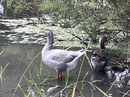

# Image captioning with Moondream

This repo contains example scripts and Jupyter notebook
for captioning images using the Moondream vision model from 
[M87 Labs](https://www.moondream.ai/)
which is small enough at 1.87B parameters to run locally and is available under the Apache 2 license.
You can also find more information about the model on
🤗 Hugging Face at <https://huggingface.co/vikhyatk/moondream2>.

The [Transformers](https://github.com/huggingface/transformers) library is used to run the pretrained model.

[Pillow](https://python-pillow.org/) is used for reading image files so anything supported by Pillow
should work in terms of input file format.

## Example Images

If you run it with no arguments it will download several 
example images from S3 I have provided for examples.

| Image                                                                                                                 | URL                                                                      |
|-----------------------------------------------------------------------------------------------------------------------|--------------------------------------------------------------------------|
| [](https://ranton-example-files.s3.us-west-2.amazonaws.com/reading.jpg)          | <https://ranton-example-files.s3.us-west-2.amazonaws.com/reading.jpg>    |
| [](https://ranton-example-files.s3.us-west-2.amazonaws.com/lighthouse.png) | <https://ranton-example-files.s3.us-west-2.amazonaws.com/lighthouse.png> |
| [](https://ranton-example-files.s3.us-west-2.amazonaws.com/birds.jpg)                | <https://ranton-example-files.s3.us-west-2.amazonaws.com/birds.jpg>      |


You can run the `caption.py` script locally after installing
requirements.

## Installing Required Dependencies
You can use these commands in a terminal to create a virtual environment,
activate the environment, and install the requirements into it.

```shell
python -mvenv .venv
source .venv/bin/activate
pip install -r requirements.txt
```
Note these commands will need adjusting if you are on Windows
rather than Mac or Linux.

If you want to try this as a notebook you can import the `caption_with_moondream.ipynb`
file into Jupyter locally or a hosted platform like
Google Colab, Snowflake Notebooks, or AWS Sagemaker Studio.

## Example Output

Example output for the sample images:
```text
$ python caption.py
Image: image_0.jpg --> A close-up photo of a person's hands holding open a book with text on the pages, positioned on a wooden surface with sunlight casting shadows.
Image: image_1.png --> The image features a white lighthouse with a black top, standing on a grassy area with a clear blue sky in the background.
Image: image_2.jpg --> The image shows two ducks in a pond with green vegetation in the background.
```

## A Note About Warnings

Currently, there are warnings output about the model due to some changes in the Transformers library.

These warnings are safe to ignore at the moment.

You can find details about this in the request for update to the Moondream owners at <https://huggingface.co/vikhyatk/moondream2/discussions/39>.


### Warnings output
```text
PhiForCausalLM has generative capabilities, as `prepare_inputs_for_generation` is explicitly overwritten. However, it doesn't directly inherit from `GenerationMixin`. From 👉v4.50👈 onwards, `PreTrainedModel` will NOT inherit from `GenerationMixin`, and this model will lose the ability to call `generate` and other related functions.
  - If you're using `trust_remote_code=True`, you can get rid of this warning by loading the model with an auto class. See https://huggingface.co/docs/transformers/en/model_doc/auto#auto-classes
  - If you are the owner of the model architecture code, please modify your model class such that it inherits from `GenerationMixin` (after `PreTrainedModel`, otherwise you'll get an exception).
  - If you are not the owner of the model architecture class, please contact the model code owner to update it.
```

## Usage Instructions

To use `caption.py` on your own images, just pass their path as command line arguments.

For example:

```shell
$ python caption.py thumbnails/mustang_sm.png

Image: /Users/ranton/Downloads/mustang.png --> A white Ford Mustang GT sports car is parked on a road with a wooded area in the background.
```

The image from the above example is available at <https://ranton-example-files.s3.us-west-2.amazonaws.com/mustang.png>.


Or you can run it directly on the thumbnail sized version like this:
```shell
$ python caption.py thumbnails/mustang_sm.png

Image: thumbnails/mustang_sm.png --> A white sports car is parked on a road with a background of trees and shrubs.
```

You can see with the lower resolution you get fewer details.


